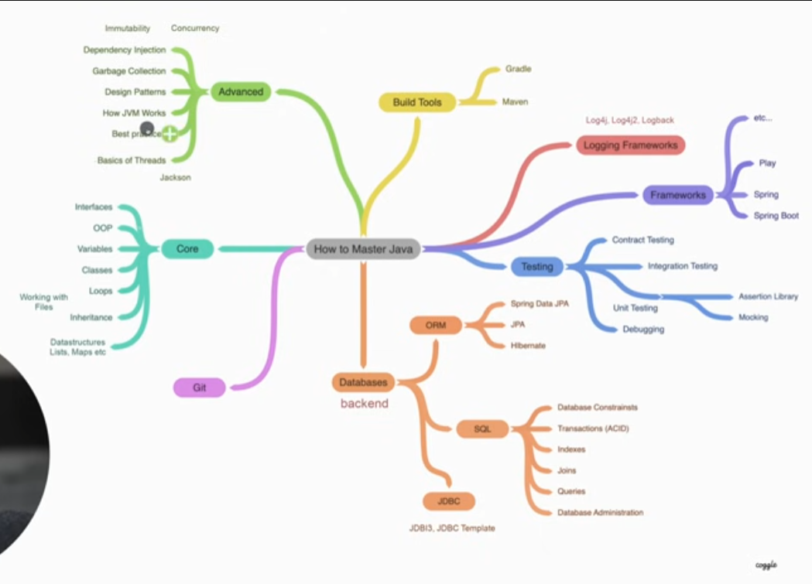

# Java_core
<h2>Introduction</h2>
<h3>0.0 Aim</h3>

I would like to up my skills as a programmer and add java as own of my maines langueges in my portfolio

<h3>1) Core</h3>
<h4>Leetcode with java</h4>

The main idea - solution more and more taskes from leetcode to undestend conceptes

<h3>2) Advanced</h3>
<h4></h4>
<h3>3) Testing</h3>
<h4>Modern testing conceptes</h4>
<h3>4) Add Kotlin</h3>
<h4></h4>